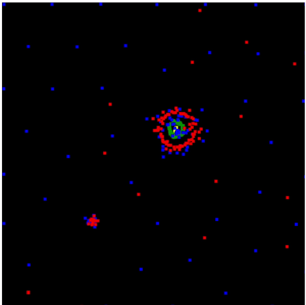

#  life.html 🎨

This HTML file is not just any file—it's a canvas of life! Dive into the mesmerizing world of particle interactions and watch as colors dance and play within the confines of your screen.

## How to Use 🚀

1. Open the `life.html` file in a web browser that supports HTML5 and JavaScript.
2. The canvas element will burst into life, showcasing particles of different hues engaged in a vibrant dance.
3. Sit back, relax, and enjoy the spectacle of colors harmonizing in a mesmerizing symphony.

## Code Overview 🧠

The magic happens in the JavaScript code enclosed within the `<script>` tags. Here's a whimsical breakdown:

- **Canvas Conjuring**: The canvas element is summoned and bestowed with the power of a 2D rendering context (stored in the variable `m`).

- **Particle Potions**: Enchanting particles are created, each bestowed with unique properties like position, velocity, and a splash of color.

- **Chromatic Cabal**: Different particle groups, each with its own color (yellow, green, blue, and red), come together to form a magical coalition.

- **Interaction Wizardry**: Rules are applied, unleashing forces between particles of various hues. The `rule` function orchestrates this cosmic dance, manipulating velocities and positions.

- **Boundary Enchantment**: A protective spell is cast, ensuring particles remain within the canvas, never venturing into the unknown.

- **Simulation Spellcasting**: The `update` function waves its wand, orchestrating the grand performance—applying interaction rules, clearing the canvas, drawing a celestial background, and summoning particles.

- **Magic Unleashed**: The simulation unfolds as the first frame is requested, setting the stage for an enchanting journey.

## Customization 🎭

Feel like tweaking the cosmic balance? Dive into the code and play with the parameters. Adjust the number of particles, alter their colors, or spice up the interaction rules. Unleash your creativity and watch as the canvas transforms into your own magical masterpiece!

## Credits 🌟

This enchanting code was crafted by taking "particle-life" repository as an inspiration by @hunar4321 .✨
